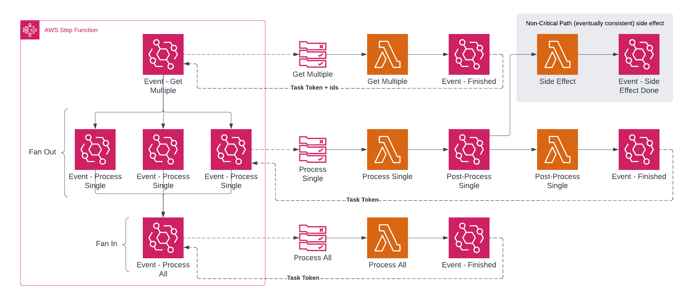
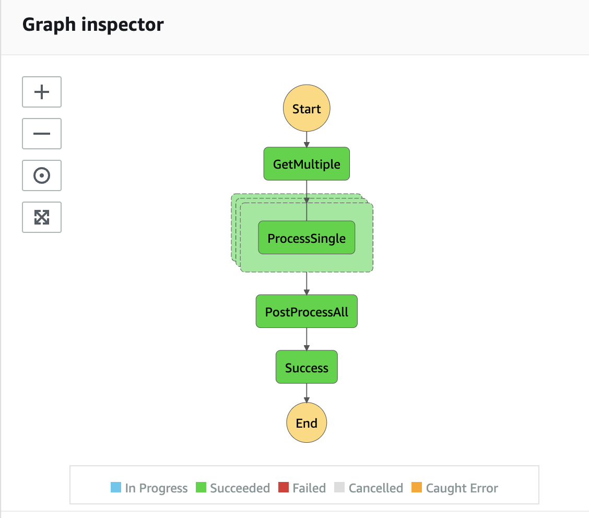
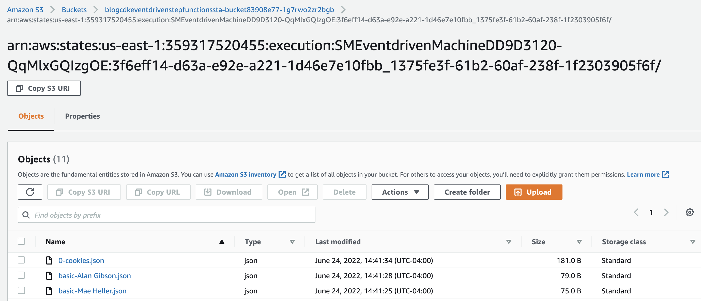

# Event-Driven Step Functions (blog post code)

This project creates the following architecture:



## Getting Started

If starting a project from scratch:
1. `npx cdk@2.x init --language typescript`
2. `npm install -D @types/node-fetch @types/aws-lambda esbuild`
3. `npm i --save node-fetch @faker-js/faker aws-sdk`

To run this project:
1. `npm install`
2. `npx cdk deploy` (have your AWS profile ready to go)
3. `aws events put-events --entries Source=project,DetailType=start,EventBusName=default,Detail=\"{}\" --region us-east-1` (this event will start the step function)
4. `npx cdk-app-cli Bucket visit-console` (this will take you quickly to the s3 bucket where files will eventually got populated)

## After running

After running the step function, if you visit the state machine page you should see a workflow like this:



and in S3 you would see your files including the final "report" file:



If you download the `0-cookies.json` file you will see the combined output with the fake data:

```json
{
  "names": [
    "Roberta Mills",
    "Mae Heller",
    "Alan Gibson",
    "Mrs. Heather West",
    "Mr. Marcia Labadie"
  ],
  "numberOfPeople": 5,
  "totalCookiesConsumed": 25
}
```